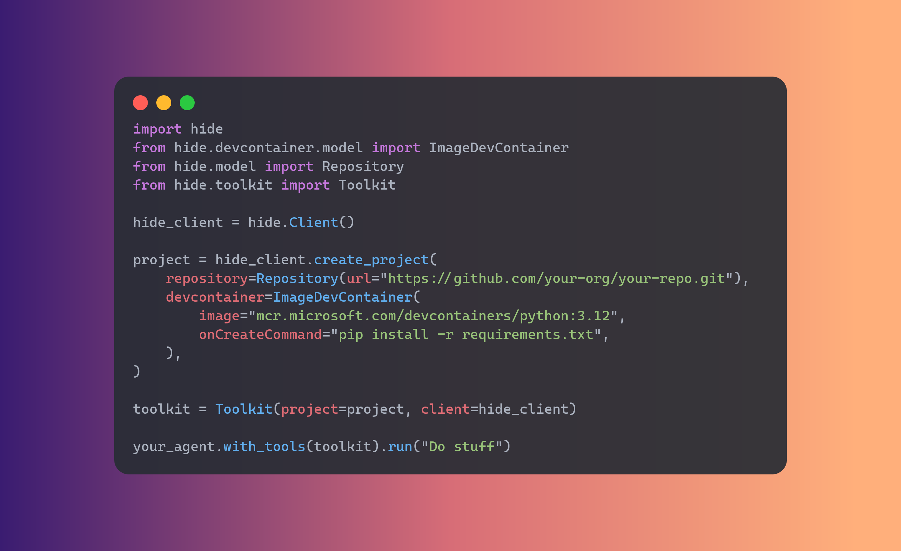

# Hide: Headless IDE for Coding Agents
<div style="display: flex; justify-content: center;">
  
</div>

## Description

Hide provides containerized development environments for codebases and exposes APIs for agents to interact with them. When given a code repo, Hide spins up a devcontainer, installs the dependencies and provides APIs for codebase interaction. Developers can craft custom toolkits using Hide APIs or use Hide's pre-built toolkits for popular frameworks like Langchain.

A typical installation for Hide consists of 2 parts: a runtime that runs on a local or remote Docker host, and an SDK that interacts with it. Runtime is the backend system responsible for managing development containers and executing tasks. SDK is a set of APIs and toolkits designed for coding agents to interact with the codebase.

This repository contains the source code for the Hide Runtime. For more information on how to use Hide and Hide SDK, go to our documentation site: https://hide.sh

## Installation

Hide Runtime can be installed using [Homebrew](https://brew.sh/) or built from source.

### Prerequisites

Hide Runtime requires Docker Engine to be installed on your system. Note that if you intend to use Hide with a remote Docker host, you will need to install Docker Engine on that host.

For installation instructions for your OS, see the [Docker Engine documentation](https://docs.docker.com/engine/install/).

### Using Homebrew

1. Add the Hide tap to your Homebrew:

    ```bash
    brew tap artmoskvin/hide
    ```

2. Install Hide using the brew install command:

    ```bash
    brew install hide
    ```

### Building from Source

To build Hide from source, follow these steps:

1. Ensure you have [Go 1.22+](https://go.dev/) or later installed on your system.
2. Clone the Hide repository:

    ```bash
    git clone https://github.com/artmoskvin/hide.git
    cd hide
    ```

3. Build the project:

    ```bash
    make build
    ```

4. (Optional) Install Hide to your `$GOPATH/bin` directory:

    ```bash
    make install
    ```

## Quickstart

You can start the runtime by running the following command:

```bash
hide run
```

You should see logs indicating that the server is running, something like: `Server started on 127.0.0.1:8080`. For more options, including how to specify the port, see help:

```bash
hide --help
```

## Contributing

See [CONTRIBUTING.md](./docs/CONTRIBUTING.md) for information on how to contribute to Hide.

## Development

See [DEVELOPMENT.md](./docs/development.md) for information on how to develop Hide.

## License

Hide is licensed under the [MIT License](./LICENSE).

